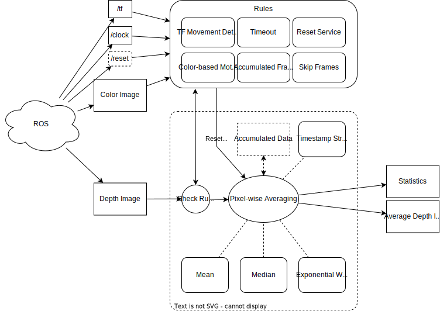

# depth_image_averaging

Notes:

- Do not use service for triggering reset. this needs syncronization between the client and the service. for example, averager may accumulate and publish data, but then the client may detect a problem and trigger reset. but it will be too late.
- for camera info, there are two things we can do.
  - do not care.
  - relay it using a topic tool
  - subscribe to it and publish together with the averaged depth image.
  - use image transport. however I don't know it it supports zero-copy

Parameters:

- min_window_size = -1 (lower accumulated data will be dropped on reset. post-truncation may cause dropping the last accumulated data. set negative value to disable.)
- max_window_size = -1 (upper limit for accumulation. triggers soft-reset. set negative value to disable.)
- min_window_time = -1.0 (lower accumulated data will be dropped on reset. post-truncation may cause dropping the last accumulated data. set negative value to disable.)
- max_window_time = -1.0 (upper limit for accumulation. triggers soft-reset. set negative value to disable.)
- max_displacement = -1.0 (upper limit for displacement in cartesian position. set negative value to disable.)
- max_rotation = -1.0 (upper limit for rotation in quaternion distance. set negative value to disable.)
- motion_reference_frame = "world"
- drop_first_n_messages = -1
- drop_last_n_messages = -1
- drop_first_messages_period = -1.0
- drop_last_messages_period = -1.0
- timestamp_strategy = FIRST_MESSAGE, **LAST_MESSAGE**, CENTER_MESSAGE (note that tf buffer limit is usually 10 seconds)
- averaging_method = MEAN, MEDIAN, EWMA (Exponential Weighted Moving Average)
- ewma_alpha (EWMA smoothing factor)

